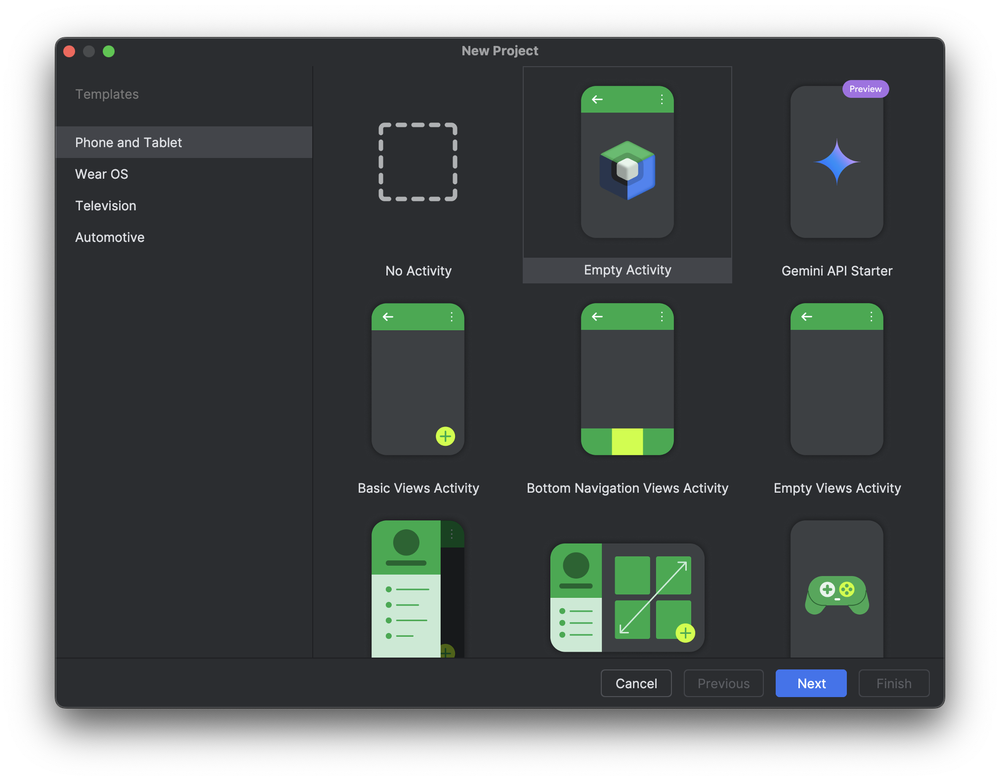
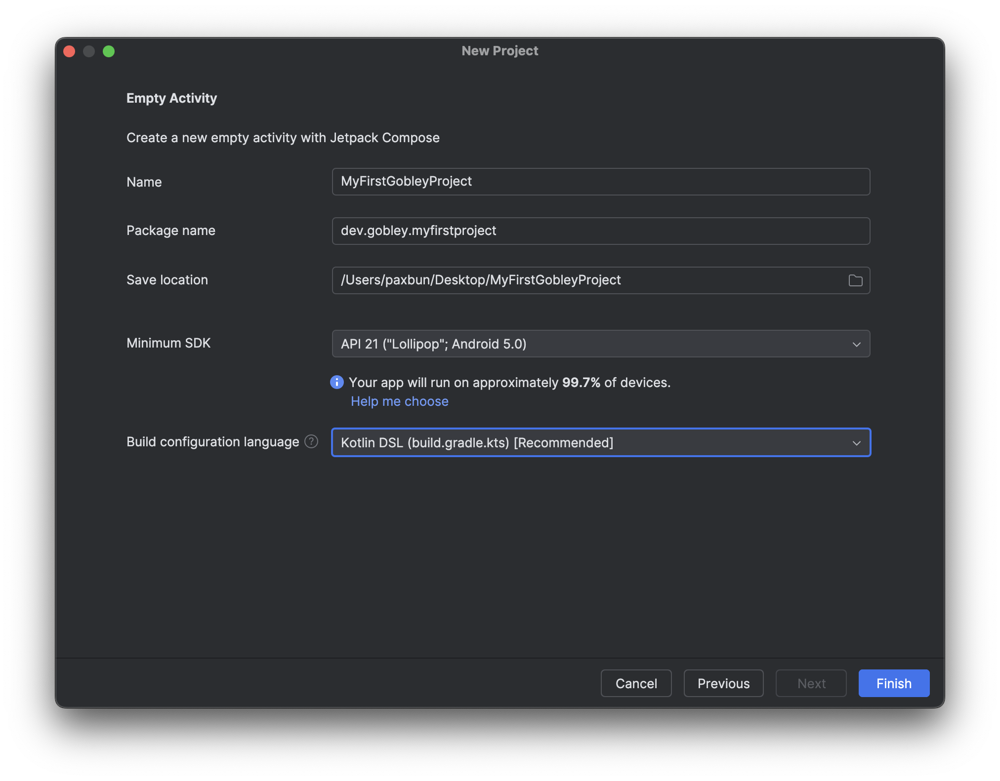
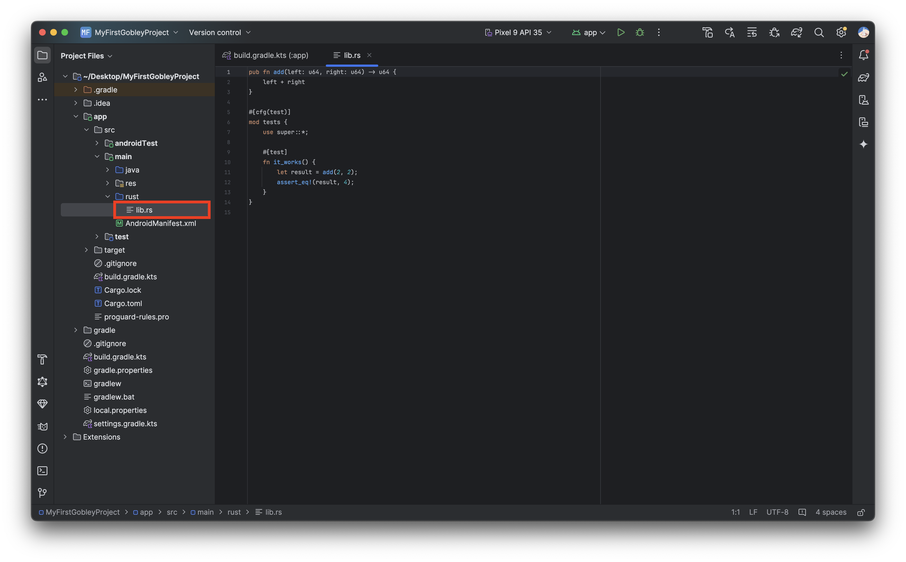
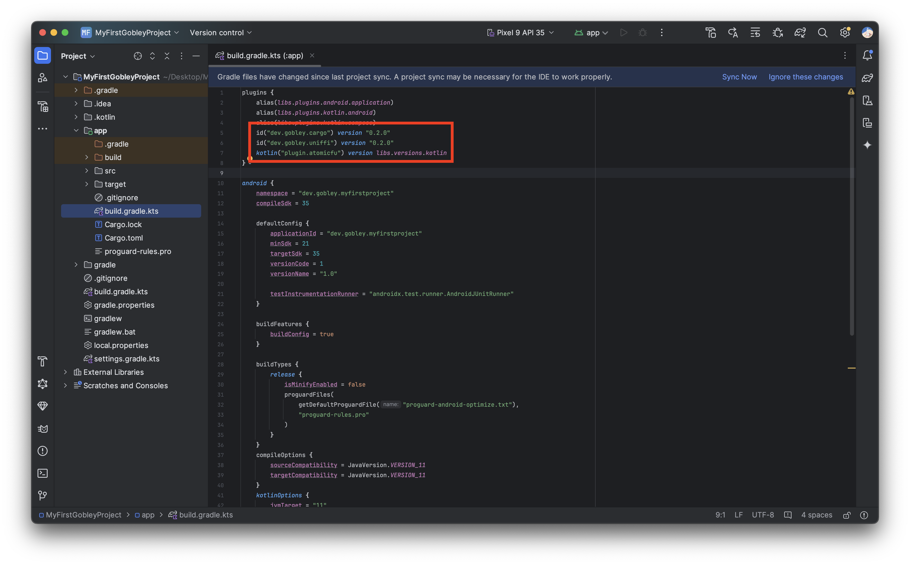
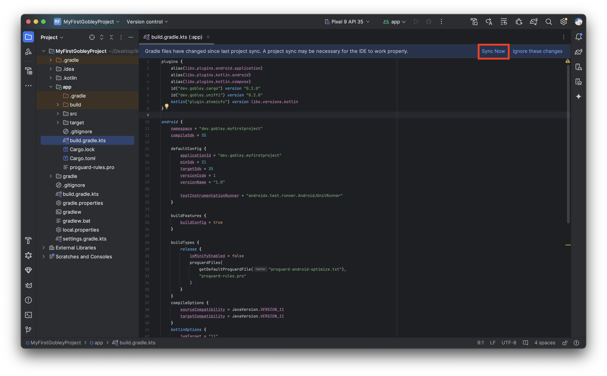
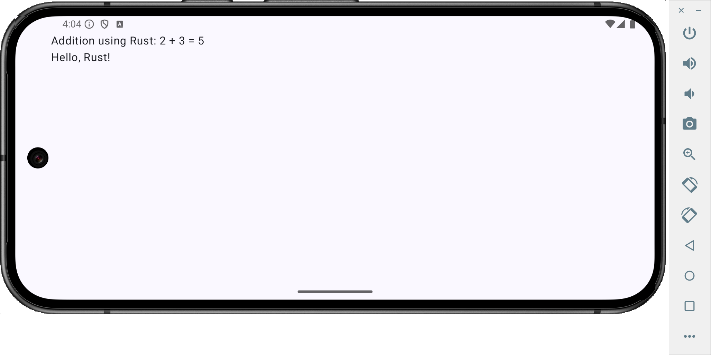

# Getting started (Android)

Welcome to Gobley! Gobley is a set of libraries and tools that help you mix Rust and Kotlin, so you
can focus on implementing your business logic. In this tutorial, you will learn how to embed Rust
code into your Android project using Gobley. If you have trouble setting up your project, please
create a question in [GitHub Discussions](https://github.com/gobley/gobley/discussions).

## Prerequisites

To develop an Android app, you need to
install [Android Studio](https://developer.android.com/studio).
Using [IntelliJ IDEA](https://www.jetbrains.com/idea/download) is also available for Android
development.

To develop in Rust, you need:

1. A [Rust toolchain](https://www.rust-lang.org/tools/install).
2. An IDE for Rust. Several options are available:
    - [Visual Studio Code](https://code.visualstudio.com/) with [
      `rust-analyzer`](https://marketplace.visualstudio.com/items?itemName=rust-lang.rust-analyzer).
    - [RustRover](https://www.jetbrains.com/rust).
    - [IntelliJ IDEA **Ultimate**](https://www.jetbrains.com/idea/download) with
      the [Rust plugin](https://www.jetbrains.com/help/idea/rust-plugin.html).
    - Other editors like Vim. Still, using `rust-analyzer` is recommended.

## Creating an Android project

Let's first create a new Android project.

1. Open Android Studio.
2. Select **File > New > New Project**.
3. Select **Empty Activity** with Compose.

> :bulb: Gobley can be used without Compose, but the rest of this tutorial will use Compose.



4. Rename the project to `MyFirstGobleyProject` and the package to `dev.gobley.myfirstproject`.
5. Make sure you selected **Kotlin DSL** for **Build configuration language**.



6. Click the **Finish** button, and the project will open.

## Adding Rust to your Android project

Let's add a Cargo package to the Android project.

1. Make sure you installed `cargo` and `rustup`.
2. Open the **Terminal** menu in Android Studio. Run:

   ```shell
   cargo init --lib --vcs none app
   ```

   Let's see what this command does:

    - `cargo init` will create a new Cargo package in `app`.
    - `--lib` means that Cargo will create a **library** crate.
    - `--vcs none` means you don't want to generate `.git` or `.gitignore`.
    - `app` is the directory where we'll code both in Rust and Kotlin.

   After running this command, the following files should be generated:

    - `app/Cargo.toml`: This file contains the definition of the Cargo package.
    - `app/src/lib.rs`: The Rust source code file.

3. Add `**/target/` to `.gitignore`.

   > :bulb: This is the folder where Cargo stores the build intermediate files and the final Rust
   > library.

4. (Optional) Move `app/src/lib.rs` to `app/src/main/rust/lib.rs`.

   

   > :bulb: When you use CMake in an Android project, C++ source files are usually located in
   > `src/main/cpp`. This procedure imitates that behavior. It feels more organized, isn't it?

5. Modify `app/Cargo.toml` like the following.

   ```toml
   # This part is already added by cargo init.
   [package]
   name = "app"
   version = "0.1.0"
   edition = "2024"

   [dependencies]
   # We need to add this.
   uniffi = "0.29.4"

   # This as well.
   [lib]
   crate-type = ["cdylib"]
   # Put this only if you moved lib.rs.
   path = "src/main/rust/lib.rs"
   ```

   Let's see what each part of the modification does:

    - `uniffi = "0.29.4"` downloads UniFFI, the library used to generate the Kotlin code (the "
      bindings") that calls the Rust library.
    - `crate-type = ["cdylib"]` will make Cargo generate a `.so` (dynamic library) file that can be
      used by Gobley.
    - `path = "src/main/rust/lib.rs"` designates the path to the Rust source code.

6. Modify `app/build.gradle.kts` like the following.

   ```kotlin
   plugins {
       // Other plugins here
       id("dev.gobley.cargo") version "0.3.5"
       id("dev.gobley.uniffi") version "0.3.5"
       kotlin("plugin.atomicfu") version libs.versions.kotlin
   }
   ```

   > :exclamation: Consider managing plugin dependencies using
   > [version catalogs](https://docs.gradle.org/current/userguide/version_catalogs.html).
   >
   > :bulb: All Gradle plugins in Gobley are published in `mavenCentral()`.

   Let's see what each plugin does:

    - `dev.gobley.cargo` builds and links the Rust library to the Kotlin application.
    - `dev.gobley.uniffi` generates the bindings using UniFFI. You can change the package name of
      the bindings inside the `uniffi {}` block.
    - `org.jetbrains.kotlin.plugin.atomicfu` is to use atomic types used by the bindings.

We're now ready to code both in Rust and Kotlin!

> :question: If you hit the **Sync Now** button at this point, you'll get a
> `Crate app not found in libapp.so` error. That's because you haven't used
> `uniffi::setup_scaffolding!();` inside the Rust code. If you encountered such an error, go
> straight to the next step.



## Defining and exposing Rust types and functions

Now is the time to code in Rust. Open `app` in Visual Studio Code.

```shell
code ./app
# or on macOS
open -a "Visual Studio Code" ./app
```

Once `rust-analyzer` is ready, you can see highlightings and inlay hints in the code editor. Modify
`src/main/rust/lib.rs` as follows.

```rust
/// This exports this Rust function to the Kotlin side.
#[uniffi::export]
fn add(lhs: i32, rhs: i32) -> i32 {
    lhs + rhs
}

/// This exports this Rust type to the Kotlin side.
#[derive(uniffi::Object)]
struct Greeter {
    greeting: String
}

#[uniffi::export]
impl Greeter {
   /// Define a constructor to be used on the Kotlin side.
   #[uniffi::constructor]
   fn new(greeting: String) -> Self {
      Self { greeting }
   }

   /// Define a method to be used on the Kotlin side.
   fn greet(&self, name: String) -> String {
      format!("{}, {name}!", self.greeting)
   }
}

// This generates extra Rust code required by UniFFI.
uniffi::setup_scaffolding!();
```


By just applying `#[uniffi::export]` or similar macros, the functions and the types become available
on the Kotlin side. Go back to Android Studio and press the **Sync Now** button.



Cargo will start building the Rust library inside Android Studio. After the build completes, open
`app/src/main/java/dev/gobley/myfirstproject/MainActivity.kt`. Add the following lines to the part
you prefer:

```kotlin
Column(Modifier.safeContentPadding()) {
    Text("Addition using Rust: 2 + 3 = ${uniffi.app.add(2, 3)}")
    val greeting = remember { uniffi.app.Greeter("Hello") }
    Text(greeting.greet("Rust"))
    DisposableEffect(greeting) {
        onDispose {
            greeting.close()
        }
    }
}
```


> :warning: To use Rust functions in Compose preview, you need to disable sandboxing. This is not
> recommended for security reasons. Please see [#85](https://github.com/gobley/gobley/issues/85) for
> details.

> :cry: Release mode Compose previews are not supported. Please
> see [#99](https://github.com/gobley/gobley/issues/99) for details.

`Greeter` and `add` exported on the Rust side are accessible on the Kotlin side! Doc-comments are
also available, so you don't have to write the same description twice.

Let's run the Android app. Hit the Run button on the upper right corner of the screen. You can see
the Rust library is included in the final app automatically, and the app communicates with Rust
without any issues.



## Next step

And that's how you embed Rust into your Kotlin project. If you need more detailed information about
Gobley, please read the [documentation](../docs/0-overview.md).