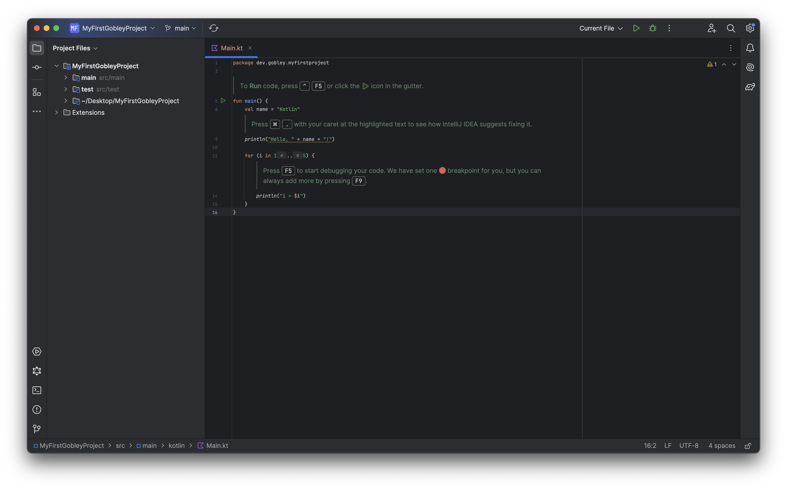
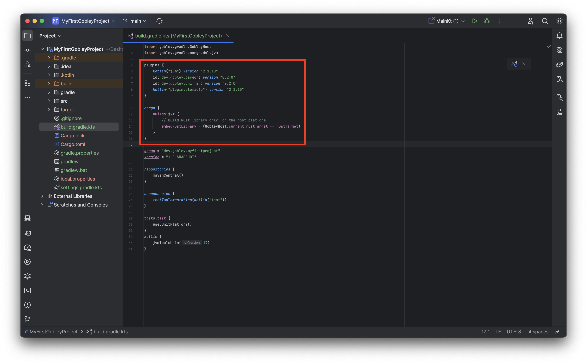
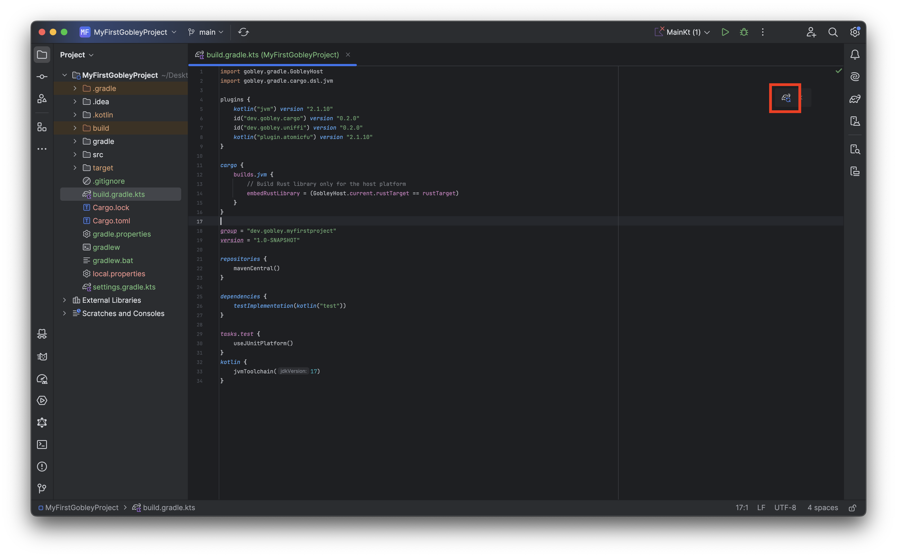

# Getting started (JVM)

Welcome to Gobley! Gobley is a set of libraries and tools that help you mix Rust and Kotlin, so you
can focus on implementing your business logic. In this tutorial, you will learn how to embed Rust
code into your Kotlin/JVM project using Gobley. If you have trouble setting up your project, please
create a question in [GitHub Discussions](https://github.com/gobley/gobley/discussions).

## Prerequisites

To develop an Kotlin/JVM program, you need to
install [IntelliJ IDEA](https://www.jetbrains.com/idea/download).
Using [Android Studio](https://developer.android.com/studio) is also available for Kotlin
development.

To develop in Rust, you need:

1. A [Rust toolchain](https://www.rust-lang.org/tools/install).
2. An IDE for Rust. Several options are available:
    - [Visual Studio Code](https://code.visualstudio.com/) with [
      `rust-analyzer`](https://marketplace.visualstudio.com/items?itemName=rust-lang.rust-analyzer).
    - [RustRover](https://www.jetbrains.com/rust).
    - [IntelliJ IDEA **Ultimate**](https://www.jetbrains.com/idea/download) with
      the [Rust plugin](https://www.jetbrains.com/help/idea/rust-plugin.html).
    - Other editors like Vim. Still, using `rust-analyzer` is recommended.

## Creating a Kotlin/JVM project

Let's first create a new Kotlin/JVM project.

1. Open IntelliJ IDEA.
2. Select **File > New > New Project**.
3. Select **Kotlin**.
4. Rename the project to `MyFirstGobleyProject`.
5. Select **Gradle** as the build system.
6. Select **Kotlin** as the Gradle DSL.
7. Change the GroupId to `dev.gobley.myfirstproject`.


8. Click the **Create** button, and the project will open.



## Adding Rust to your Kotlin/JVM project

Let's add a Cargo package to the Kotlin/JVM project.

1. Make sure you installed `cargo` and `rustup`.
2. Open the **Terminal** menu in IntelliJ IDEA. Run:

   ```shell
   cargo init --lib --name my-first-gobley-project --vcs none .
   ```

   Let's see what this command does:

    - `cargo init` will create a new Cargo package in `.` (the current directory).
    - `--lib` means that Cargo will create a **library** crate.
    - `--name my-first-gobley-project` means that the name of the resulting Cargo package will be
      `my-first-gobley-project`. Cargo doesn't like camelCase.
    - `--vcs none` means you don't want to generate `.git` or `.gitignore`.
    - `.` is the directory where we'll code both in Rust and Kotlin.

   After running this command, the following files should be generated:

    - `Cargo.toml`: This file contains the definition of the Cargo package.
    - `src/lib.rs`: The Rust source code file.

3. Add `/target` to `.gitignore`.

   > :bulb: This is the folder where Cargo stores the build intermediate files and the final Rust
   > library.

4. (Optional) Move `src/lib.rs` to `src/main/rust/lib.rs`.

   

   > :bulb: When you use CMake in an Android project, C++ source files are usually located in
   > `src/main/cpp`. This procedure imitates that behavior. It feels more organized, isn't it?

5. Modify `Cargo.toml` like the following.

   ```toml
   # This part is already added by cargo init.
   [package]
   name = "my-first-gobley-project"
   version = "0.1.0"
   edition = "2024"

   [dependencies]
   # We need to add this.
   uniffi = "0.29.4"

   # This as well.
   [lib]
   crate-type = ["cdylib"]
   # Put this only if you moved lib.rs.
   path = "src/main/rust/lib.rs"
   ```

   Let's see what each part of the modification does:

    - `uniffi = "0.29.4"` downloads UniFFI, the library used to generate the Kotlin code (the "
      bindings") that calls the Rust library.
    - `crate-type = ["cdylib"]` will make Cargo generate a `.dll` (Windows), `.dylib` (macOS), or
      `.so` (Linux) file that can be used by Gobley.
    - `path = "src/main/rust/lib.rs"` designates the path to the Rust source code.

6. Modify `build.gradle.kts` like the following.

   ```kotlin
   import gobley.gradle.GobleyHost
   import gobley.gradle.cargo.dsl.jvm

   plugins {
       kotlin("jvm") version "<kotlin version>"
       id("dev.gobley.cargo") version "0.3.5"
       id("dev.gobley.uniffi") version "0.3.5"
       kotlin("plugin.atomicfu") version "<kotlin version>"
   }

   cargo {
       builds.jvm {
           // Build Rust library only for the host platform
           embedRustLibrary = (GobleyHost.current.rustTarget == rustTarget)
       }
   }
   ```

   > :exclamation: Consider managing plugin dependencies using
   > [version catalogs](https://docs.gradle.org/current/userguide/version_catalogs.html).
   >
   > :bulb: All Gradle plugins in Gobley are published in `mavenCentral()`.

   Let's see what each plugin does:

    - `dev.gobley.cargo` builds and links the Rust library to the Kotlin application. The `cargo {}`
      block controls Rust build options. In the above code, we instructed Cargo to build the library
      only for the host platform.
    - `dev.gobley.uniffi` generates the bindings using UniFFI. You can change the package name of
      the bindings inside the `uniffi {}` block.
    - `org.jetbrains.kotlin.plugin.atomicfu` is to use atomic types used by the bindings.

We're now ready to code both in Rust and Kotlin!

> :question: If you hit the **Sync Now** button at this point, you'll get a
> `Crate my_first_gobley_project not found in [lib]my_first_gobley_project.{dll, dylib, so}` error.
> That's because you haven't used `uniffi::setup_scaffolding!();` inside the Rust code. If you
> encountered such an error, go straight to the next step.



## Defining and exposing Rust types and functions

Now is the time to code in Rust. Open the project folder in Visual Studio Code.

```shell
code .
# or on macOS
open -a "Visual Studio Code" .
```

Once `rust-analyzer` is ready, you can see highlightings and inlay hints in the code editor. Modify
`src/main/rust/lib.rs` as follows.

```rust
/// This exports this Rust function to the Kotlin side.
#[uniffi::export]
fn add(lhs: i32, rhs: i32) -> i32 {
    lhs + rhs
}

/// This exports this Rust type to the Kotlin side.
#[derive(uniffi::Object)]
struct Greeter {
    greeting: String
}

#[uniffi::export]
impl Greeter {
   /// Define a constructor to be used on the Kotlin side.
   #[uniffi::constructor]
   fn new(greeting: String) -> Self {
      Self { greeting }
   }

   /// Define a method to be used on the Kotlin side.
   fn greet(&self, name: String) -> String {
      format!("{}, {name}!", self.greeting)
   }
}

// This generates extra Rust code required by UniFFI.
uniffi::setup_scaffolding!();
```


By just applying `#[uniffi::export]` or similar macros, the functions and the types become available
on the Kotlin side. Go back to IntelliJ IDEA and press the **Sync Gradle Changes** button.



Cargo will start building the Rust library inside IntelliJ IDEA. After the build completes, modify
`src/main/kotlin/Main.kt` as follows.

```kotlin
package dev.gobley.myfirstproject

import uniffi.my_first_gobley_project.Greeter
import uniffi.my_first_gobley_project.add

fun main() {
    println("Addition using Rust: 2 + 3 = ${add(2, 3)}")
    Greeter("Hello").use { greeting ->
        println(greeting.greet("Rust"))
    }
}
```

`Greeter` and `add` exported on the Rust side are accessible on the Kotlin side! Doc-comments are
also available, so you don't have to write the same description twice.

Let's run the program. Hit the Run button on the upper right corner of the screen. You can see the
program communicates with Rust without any issues.


## Next step

And that's how you embed Rust into your Kotlin project. If you need more detailed information about
Gobley, please read the [documentation](../docs/0-overview.md).